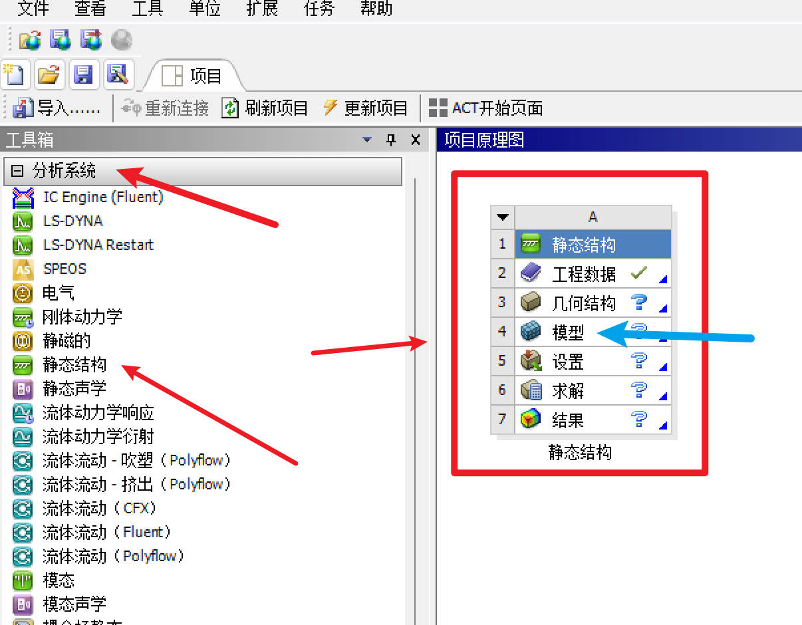
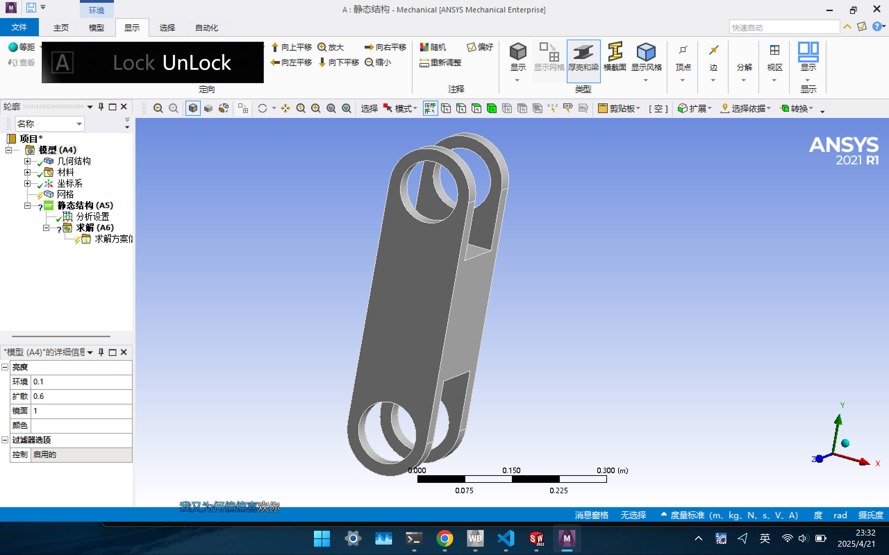
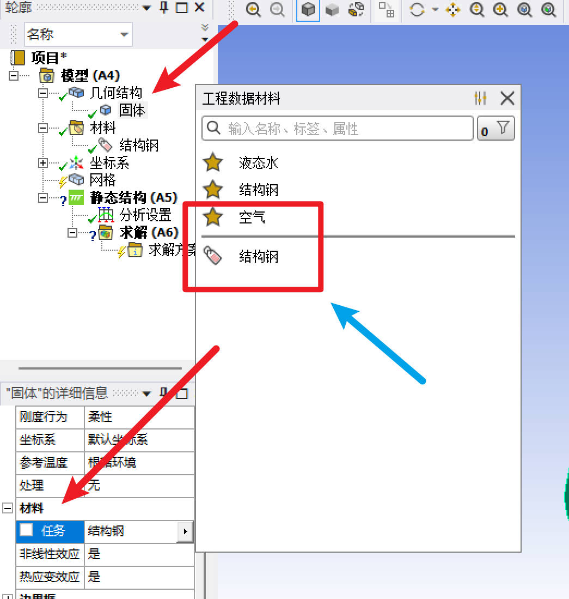
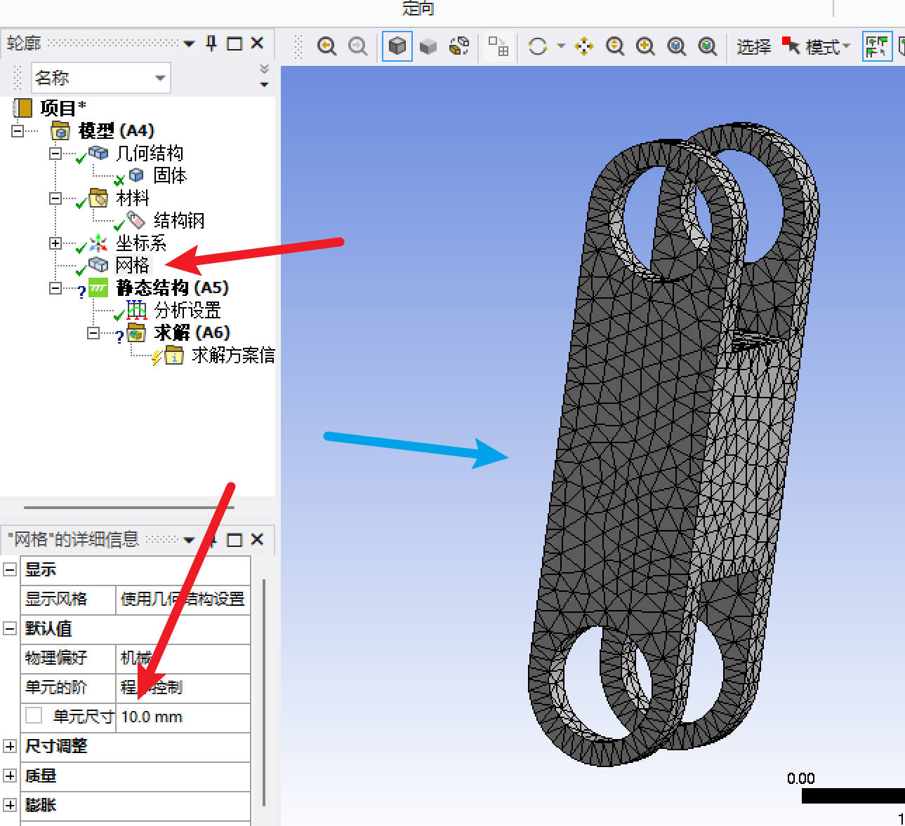
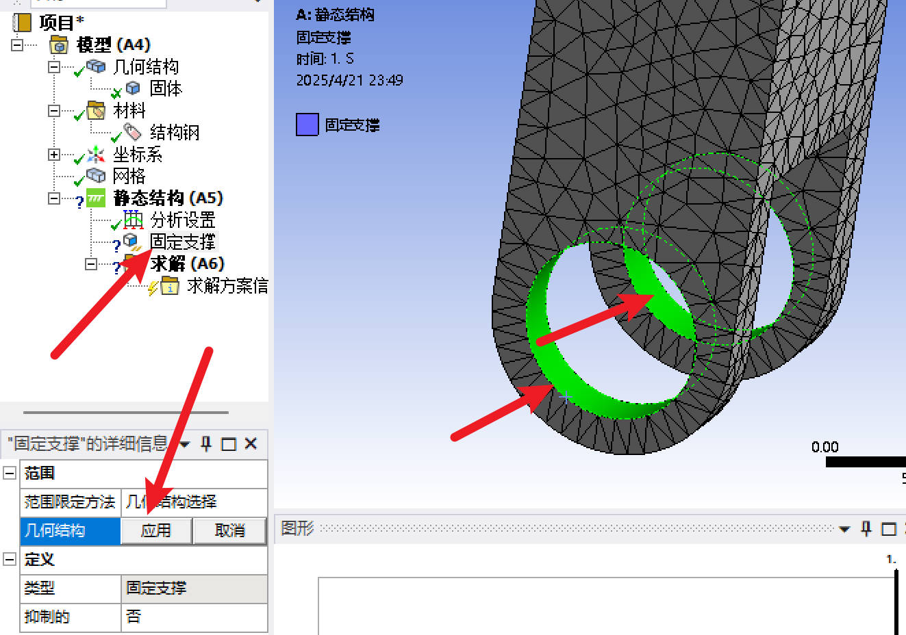
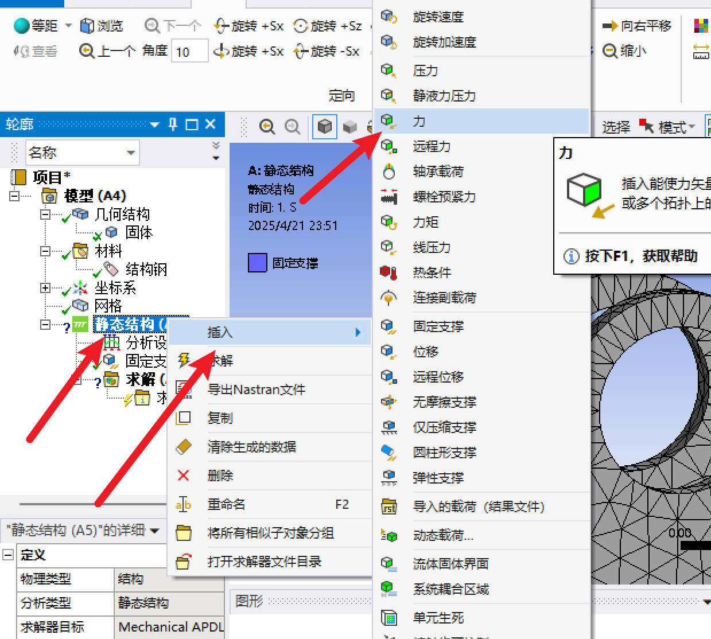
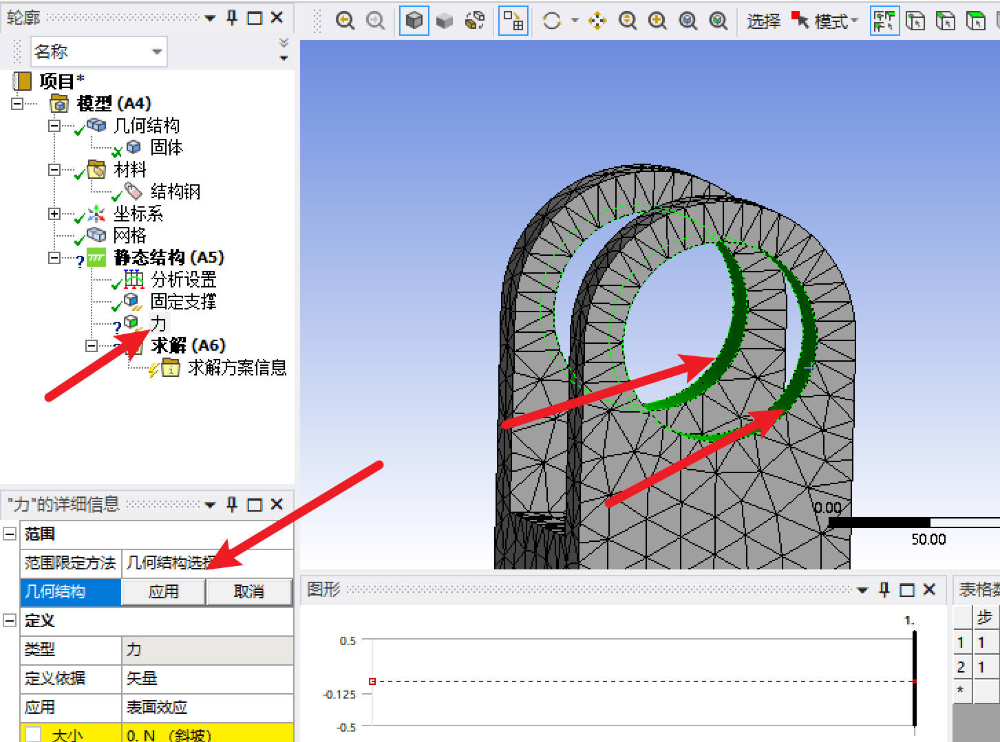
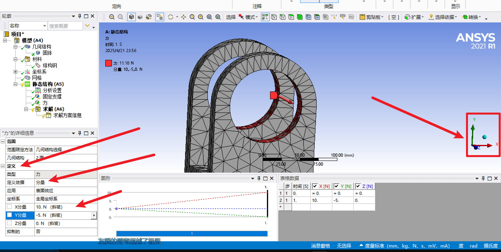
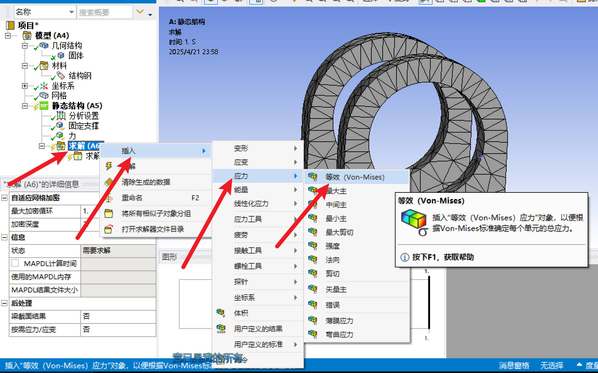
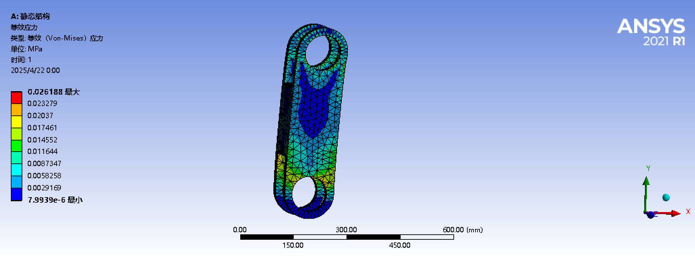

# Finite Element Analysis

## 目录

- [1. 静力学](#静力学分析)
    - [1.1 单零件分析](#单个零件的静力学分析)
- [2. 刚体动力学](#刚体动力学)
    - [2.1 回转体分析](#回转体分析)
- [3. 显式动力学](#显示动力学)
    - [3.1 高速撞击](#高速撞击)

### 1 静力学

##### 1.1 单个零件分析

###### 1.1.1 模块选择：静力学

###### 1.1.2 进入分析页面：

###### 1.1.3 材料选择：

###### 1.1.4 网格划分（右键生成）：

###### 1.1.5 选择固定支撑处：
固定支持选择：

固定位置选择（Ctrl可多选）：

###### 1.1.5 选择力：

选择基本力（需要点击应用）：

选择力作用对象（Ctrl可多选）：

###### 1.1.6 选择力分量：

###### 1.1.7 选择分析类型：

###### 1.1.8 查看静力学分析结果：

### 2 刚体动力学

##### 2.1 回转体分析

###### 2.1.1 选择刚体动力学模块

###### 2.1.2 选择材料、导入装配体后进入分析页面：

###### 2.1.3 材料选择：

###### 2.1.4 连接配置：

删除软件自动配合的连接：

添加固定副：

选择固定面（不可多选，每个固定面要设置独立的固定副）：

添加回转副：

选择相对回转对象（从固定点副回转点出发，第一个为参考，第二个为移动，以此重复）：

...，重复选择，直到完成

###### 2.1.5 划分网格，插入标准重力

插入地球标准重力：

设置重力方向：

###### 2.1.6 设置分析时间：

###### 2.1.7 设置随机扰动与惯性参考系：

###### 2.1.8 设置求解内容

###### 2.1.9 执行求解分析

### 3 显式动力学

##### 3.1 高速撞击

###### 3.1.1 材料选择添加
在显示动力学分析中，选择材料是非常重要的一步，与刚体动力学、静力学不同，显示动力学的主要分析材料需要选择“显式材料”这一类动态本构关系材料。

###### 3.1.2 正常导入几何结构，进入分析页面：
注意：在建模的时候，撞击对象和被撞击对象的距离不需要距离太远，这是无意义的计算，尽量让两者非常接近，否则只会浪费算力

###### 3.1.3 选择材料
针对不同的分析对象，对于结构体可以选择结构钢，但对于主要被分析对象，必须选择显式材料（只示例被撞击对象的选材，其他均按需求来）：

###### 3.1.4 连接：
在显示动力学中，几何体的连接可以尽量的简化，忽略其他的零部件，只需要分析被撞击对象即可，至于摩擦或无摩擦，均可按照需求来选择，这点在显式动力学中不强求：

###### 3.1.5 网格划分：
由于显示动力学对网格异常敏感，被撞击处的网格划分必须非常密，否则当time step或energy非常大时会直接报错，导致无法计算。
为了保证算力的足够，可以选采用选4边，然后类型选择`分区数量`的方式进行分割（分区数量先肉眼观察，计算出错则加密），注意，四周的`两边`都需要，图示只有两侧，实际上下也要：

分析撞击位置，我们可以根据撞击位置选择偏置类型，根据需要的方式对网格划分进行偏执，如图为居中，那么我的网格偏置类型就设置为`两边粗，中间密`：

生成网格，可以得到如下图的网格划分结果：

###### 3.1.6 分析设置：
在显式动力学的分析设置中，设置结束时间，这里的结束时间表示的实际上是撞击发生的瞬时时间，一般都非常非常短，对于已经有撞击物移动速度的情况，可以询问AI结束时间设置为多少更好：

###### 3.1.7 实际条件设置：
根据实际情况调整固定支撑与速度，需**注意**：在实际情况下，被撞击物体是无固定支撑的，而是单独创建一个静力学分析，再导入初始条件中，作为‘预应力’固定，以下是示例：

###### 3.1.8 添加求解对象：
注意，当出现错误时，可以适当的减小‘结束时间’或加密网格
