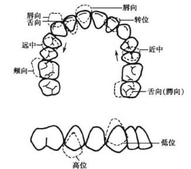
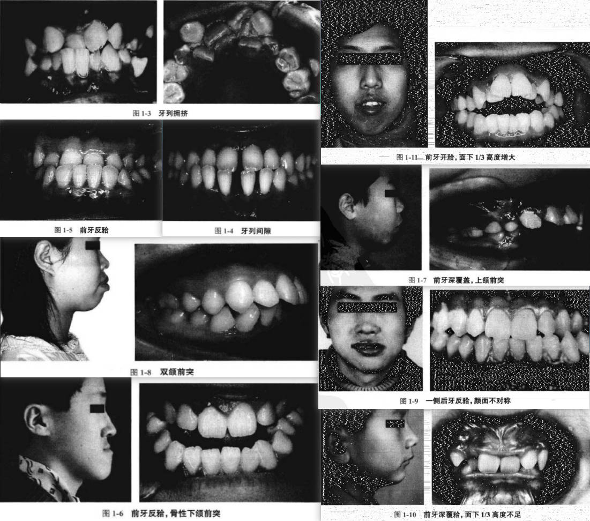
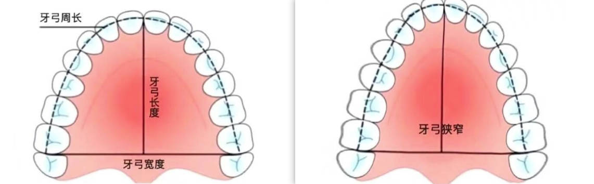
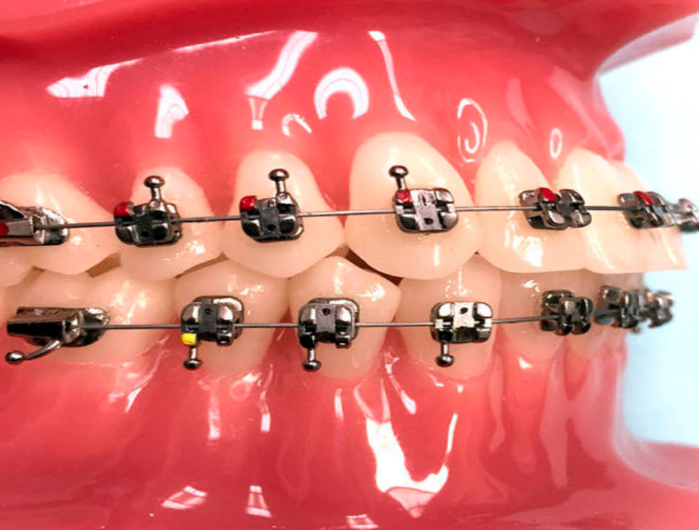
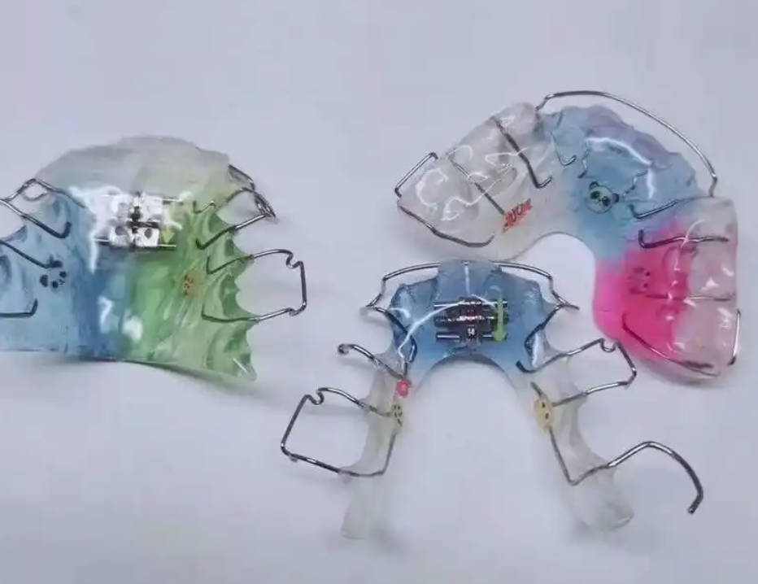
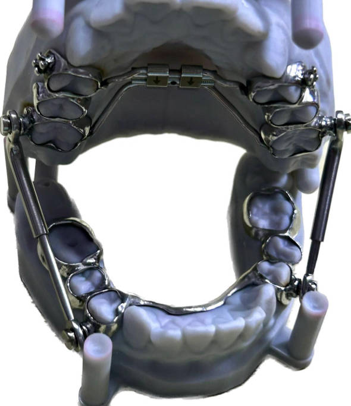

# 口腔正畸学

## 目录
- [一、错颌畸形的临床标签](#错颌畸形的临床标签)
- [二、错颌畸形的矫治](#错颌畸形的矫治)

#### 一、错颌畸形的临床标签

**牙弓形态和牙齿排列异常：**

在上图中，基本示例了各类牙齿的错位类型
|错位类型|方向示例|
|:-----:|:-----:|
|唇向|往嘴唇方向偏移|
|舌向|往舌头方向偏移|
|颊向|向脸颊方向偏移|
|转位|发生角度错位|
|远中|偏离中心线向外|
|近中|偏离中心线向内|
|高位|向上方偏移|
|低位|向下方偏移|

**牙错误实际案例**：

**咬合关系标准**：

1. **个别正常颌**：轻微错颌畸形，生理功能无大碍；
2. **理想正常颌**：保存全副牙齿，牙齿在上下牙弓排列整齐、上下牙尖窝完全正确，上下牙弓关系非常理想

**错颌畸形的危害**：
|危害类型|表现|
|:-----:|:--:|
|牙颌面发育|影响牙颌面软硬组织正常发育，如‘没有上下牙弓的协调关系，导致过度向前发育，最后成为新月状面型’|
|口腔健康|错颌牙齿不易自洁，好发龋病、牙龈炎、牙周炎、牙周损坏|
|口腔功能|由严重错颌畸形导致，如前牙开颌导致发音异常、后牙锁颌影响咀嚼功能、下颌前突导致吞咽异常、下颌后缩影响正常呼吸|
|容貌外观|呈现：开唇露齿、双颌前突、长面、短面等|

#### 二、错颌畸形的矫治

**错颌畸形的矫治方法**：
1. **预防矫治**：如在怀孕时，母亲妊娠期注意营养，防止过量放射线照射以及药物的使用。儿童在生出萌芽后要定期检查，早发现问题早处理；
2. **阻断矫治**：适用于错颌畸形早期，如通过拔牙、使用简单颌垫舌簧矫治器矫正；
3. **一般矫治**：针对不同牙颌面畸形选用各类矫治器，如活动矫治器、固定矫治器、功能性矫治器等；
4. **外科矫治**：对骨源性错颌采用外科手术矫治；

**矫治器分类**：
1. **固定矫治器**：通过粘固剂将矫治附件黏固在牙面，通过矫治弓丝与牙齿上的矫治附件发生关系来矫治牙齿。目前应用最广泛的是方丝弓、直丝弓系列矫治；

2. **活动矫治器**：由固定装置的卡环、邻间钩、基托、矫治弹簧组成，较多用于预防性矫治与阻断行矫治；

3. **功能性矫治器**：通过患者口颌系统肌力带来的矫治力进行矫治；

**错颌矫治的标准颌目标**：
1. **矫治标准**：对于错颌畸形，矫治的标准为‘**个别正常颌**’，实现平衡、稳定、美观；
2. ***形态要求***：上下牙弓形态正常、牙齿排列整齐、上下前牙颌后牙覆合/覆盖正常、尖牙与磨牙中兴关系正常、上下颌间位置及颅面关系正常；
3. **功能方面**：咬合运动正常、咬合运动时无早接触及颌干扰、正中关系位与正中颌位关系正常，颌关节功能与运动正常，吞咽运动正常；